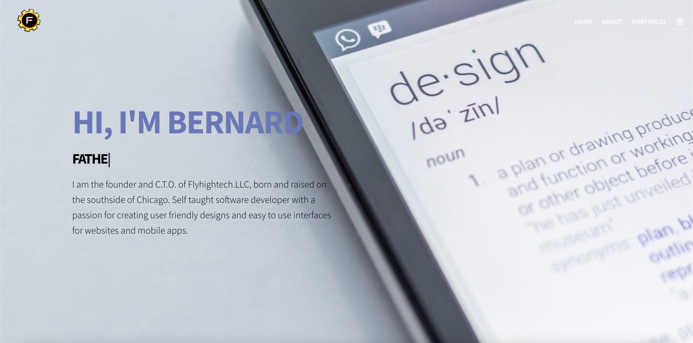

# bentheengineer

Portfolio website files will be held here. Hopefully this will all make more sense to me next time I read it. 

Today I learned that you have to press the button to change the cursor So you can edit the file. 

